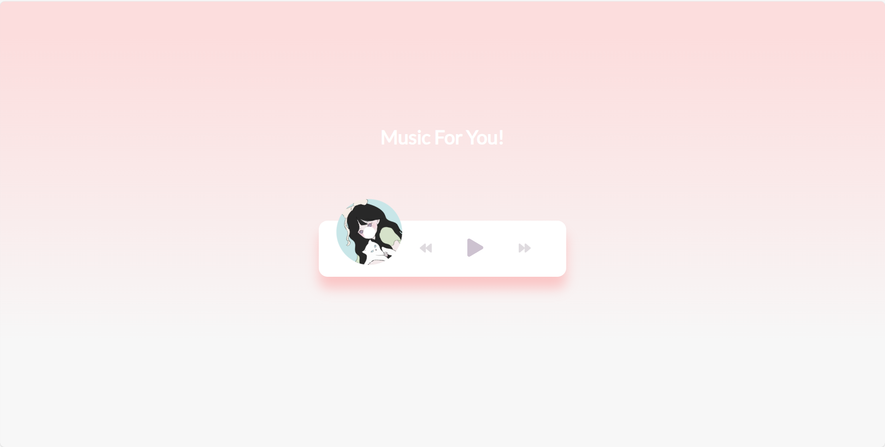
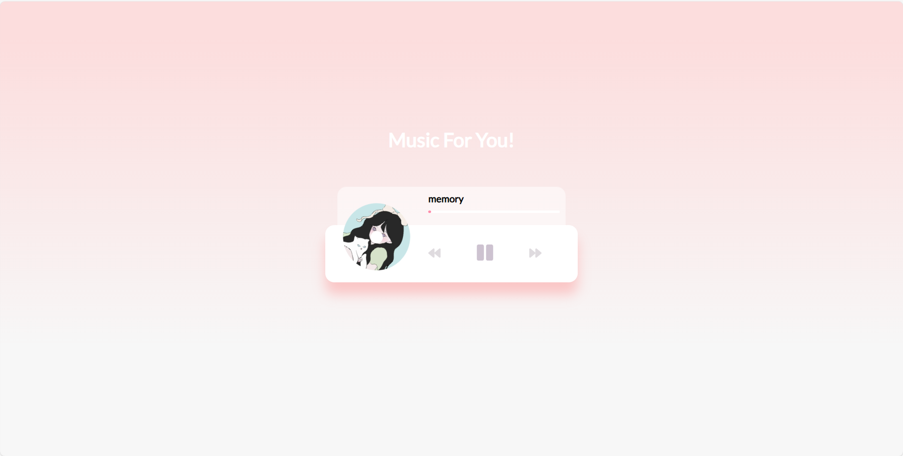
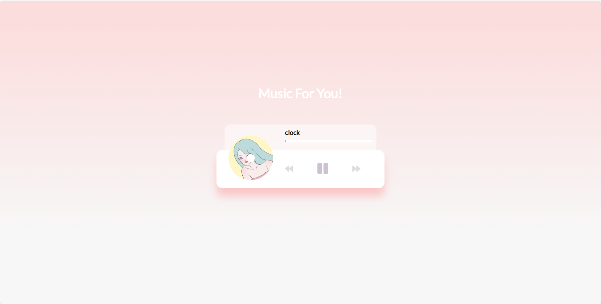
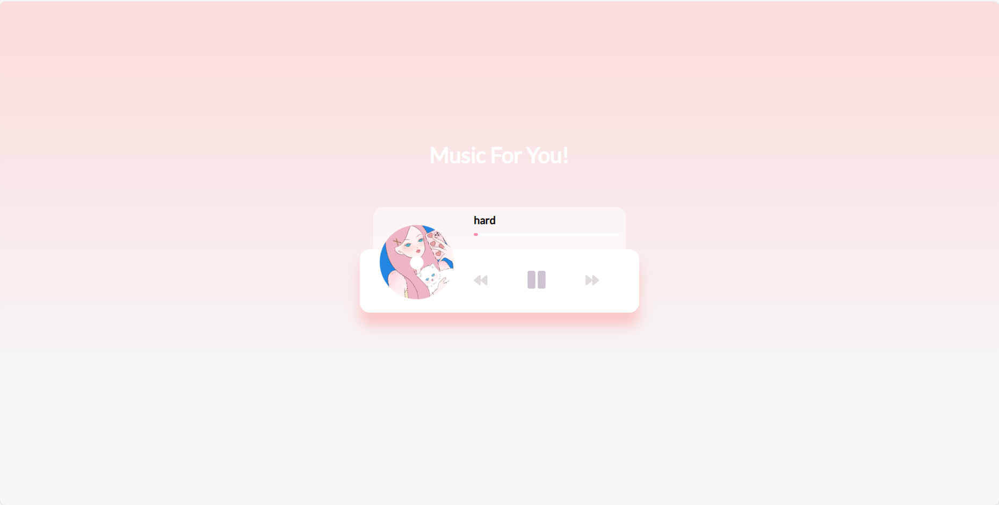

## Music Player

制作一个具有简单动画效果和交互功能的音乐播放器。

 

 

 

## 项目功能

- 为音乐播放器创建UI，包括旋转图像和音乐信息弹出窗口
- 添加播放和暂停功能
- 切换音乐
- 进度条

## 项目信息
- 使用HTML+CSS简单布局
- 变量声明 | 将三首歌装入数组中
- 开始播放 | 在触发这个函数之后，开始按钮隐藏，暂停按钮出现，并播放歌曲，图片开始旋转
- 暂停播放 | 与开始播放函数同理，并暂停图片的旋转
- 切歌 | 无论切上一首歌还是下一首歌时我们需要先暂停歌曲，再进行对歌曲的操作（index++/index–），判断index是否高于上限或低于下限，最后再开始下标为index的歌曲
- 图片旋转 |图片转动的函数，当音乐播放的时候调用rotate（）函数，就可以实现图片的旋转；

